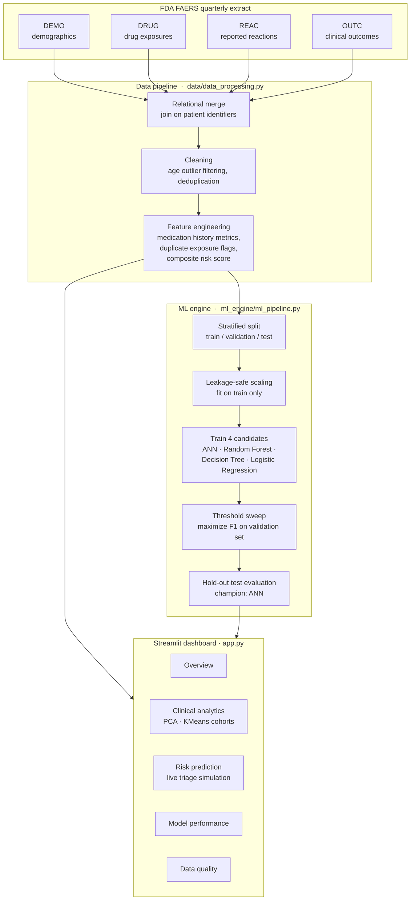
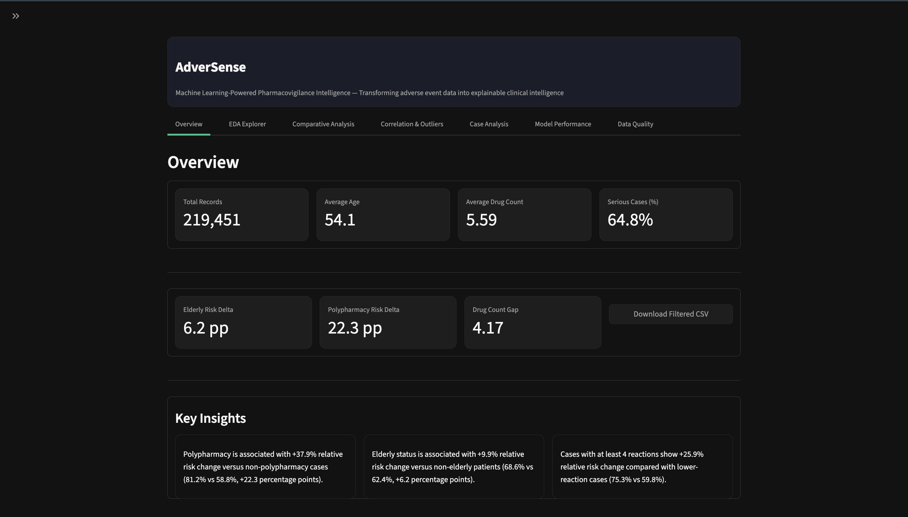
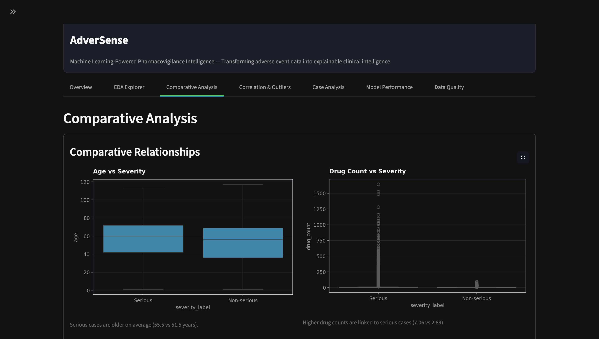
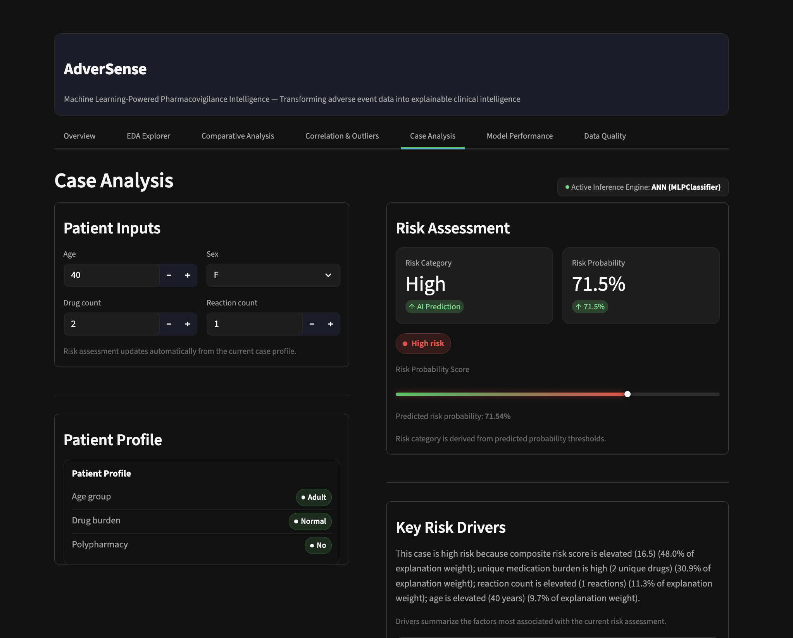
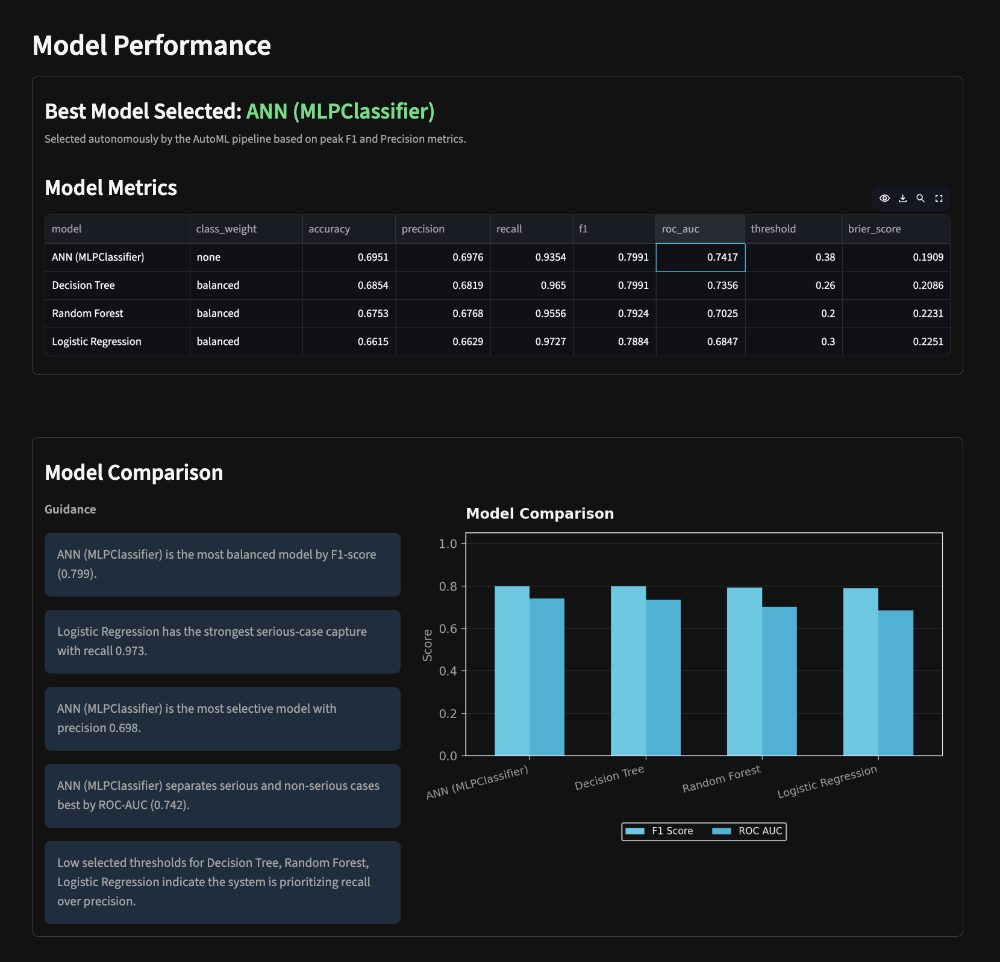
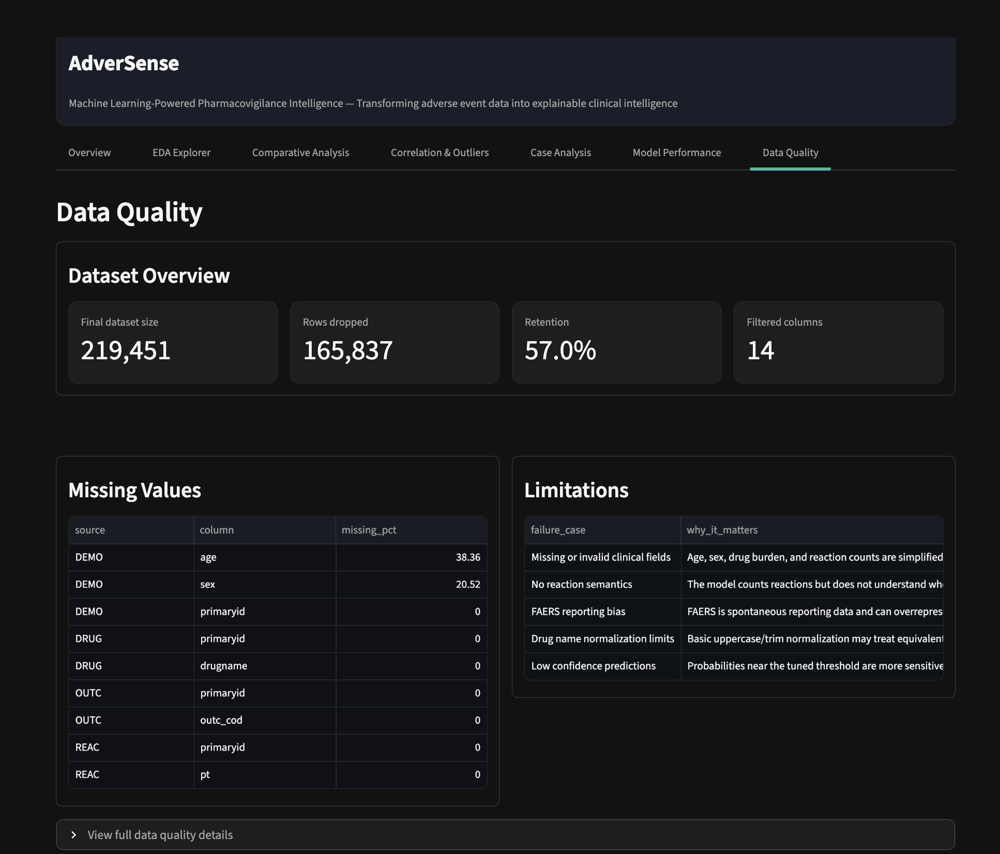

# AdverSense

**Machine learning–powered pharmacovigilance intelligence platform**

*Transforming adverse event data into explainable clinical intelligence.*

     

AdverSense analyzes FDA FAERS adverse event reports and supports clinical risk assessment through an automated ML pipeline, interactive analytics, and explainable predictions — all on standard local hardware.

---

## Table of contents

- [Why AdverSense](#why-adversense)
- [How it works](#how-it-works)
- [Key features](#key-features)
- [Results](#results)
- [Screenshots](#screenshots)
- [Repository structure](#repository-structure)
- [Installation](#installation)
- [Reproducing results](#reproducing-results)
- [Future improvements](#future-improvements)
- [License](#license)

---

## Why AdverSense

Spontaneous reporting databases like FDA FAERS contain millions of records split across independent demographic, drug, reaction, and outcome flat files. Extracting clinical insight from them means solving three problems at once:

| Problem | What it looks like in practice |
|---|---|
| **Fragmented relational data** | Four separate ASCII files (DEMO, DRUG, REAC, OUTC) that must be scrubbed and joined on patient identifiers before any analysis |
| **Target leakage risk** | Naive preprocessing lets test-set information bleed into training, inflating reported performance |
| **Class imbalance + bad default thresholds** | Serious events dominate the data, and the default 0.5 classification threshold silently misses high-risk cases |

AdverSense automates the entire workflow — data engineering, model training, threshold optimization, and interactive triage — in a single application.

> **Note:** Raw FAERS ASCII files are excluded from this repository due to size (each quarterly file exceeds 100 MB). See `scripts/download_faers.py` for download instructions, or use the provided sample dataset for quick testing.

---

## How it works



The pipeline flows in three stages:

1. **Data preprocessing** — filters demographic age outliers and joins the four relational source files on unique patient identifiers.
2. **Feature engineering** — derives medication history metrics, duplicate exposure flags, and a composite risk score.
3. **Automated ML pipeline** — performs stratified train/validation/test splits, applies standard scaling fit strictly on training data, trains four candidate models, and sweeps classification thresholds on the validation split to maximize class F1-scores.

The trained champion model then powers the dashboard's live risk prediction, while the processed dataset feeds cohort analytics.

---

## Key features

### Data engineering
- **Relational pipeline** — merges raw demographic tables with drug exposures, reactions, and outcome logs.
- **Leakage prevention** — scaling parameters and splits are computed strictly on training data, preventing optimistic performance inflation.

### Machine learning
- **Candidate benchmarks** — automated training sweeps across ANN (MLPClassifier), Random Forest, Decision Tree, and Logistic Regression.
- **Recall-optimized thresholding** — an offline evaluation loop sweeps classification thresholds against the validation split to capture high-risk reports that default thresholds miss.

### Clinical decision support
- **Triage stratification** — maps predictive probabilities into Low, Medium, and High clinical risk categories.
- **Explainable weights** — local feature importance approximations computed using test-split permutations.

### Analytics
- **Dimensionality reduction** — projects high-dimensional patient data onto 2D PCA spaces.
- **Cohort clustering** — unsupervised KMeans groupings for demographic triage.

### Developer experience
- **Modular structure** — codebase organized into logical packages (`core`, `data`, `ml_engine`, `frontend`).
- **Continuous integration** — GitHub Actions workflow running flake8 checks and the pytest unit test suite on every push.

---

## Results

Classification decision thresholds were optimized on the validation split to maximize class F1-scores, resolving the majority-class dominance typical of spontaneous reporting datasets. Hold-out **test set** results on the full 2025 Q4 FAERS extract (219K+ processed reports):

| Model | Accuracy | Precision | Recall | F1-Score | ROC-AUC | Optimal threshold |
|---|---|---|---|---|---|---|
| **ANN (MLPClassifier)** ⭐ | 69.51% | 69.76% | **93.54%** | 0.7991 | **0.7417** | 0.38 |
| Decision Tree | 68.54% | 68.19% | 96.50% | 0.7991 | 0.7356 | 0.26 |
| Random Forest | 67.53% | 67.68% | 95.56% | 0.7924 | 0.7025 | 0.20 |
| Logistic Regression | 66.15% | 66.29% | 97.27% | 0.7884 | 0.6847 | 0.30 |

The **ANN (MLPClassifier)** is selected as the champion model for its optimal precision–recall balance. All metrics are reproducible — see [Reproducing results](#reproducing-results).

---

## Screenshots

| | |
|---|---|
|  **Overview** — cohort demographics and active filters |  **Clinical analytics** — medication spreads and age distributions |
|  **Risk prediction** — live patient simulation and triage dial |  **Model performance** — AutoML benchmarks and evaluation curves |
|  **Data quality** — source row drops, ingestion stats, and validation audits | |

---

## Repository structure

```
AdverSense/
├── .github/
│   └── workflows/
│       └── ci.yml               # CI pipeline: flake8 + pytest
├── core/
│   ├── config.py                # Parameters and palettes
│   ├── pipeline_logging.py      # Logger configuration
│   └── utils.py                 # UI and math helpers
├── data/
│   ├── data_processing.py       # Relational joins and preprocessing
│   ├── sample_adverse_events.csv# Stratified real-FAERS sample (3,000 rows)
│   └── sample_reports.csv       # Sample cases for batch uploader testing
├── docs/
│   ├── ARCHITECTURE.md          # Pipeline engineering details
│   └── SETUP.md                 # Environment setup instructions
├── frontend/
│   ├── ui_components.py         # Streamlit visual components
│   └── visualizations.py        # Figure helpers
├── ml_engine/
│   ├── decision_support.py      # KPI summary calculations
│   ├── ml_pipeline.py           # AutoML training sweeps
│   └── risk_logic.py            # Normalization rules and checks
├── results/
│   ├── metrics.json             # Full FAERS evaluation results
│   └── metrics_sample.json      # Sample data evaluation results
├── scripts/
│   └── download_faers.py        # FAERS download instructions
├── screenshots/                 # Dashboard interface captures
├── tests/
│   └── test_pipeline.py         # Pipeline unit tests
├── app.py                       # Streamlit entry point
├── evaluate.py                  # Reproducible metrics evaluation
├── generate_sample.py           # Stratified sample generator
└── requirements.txt
```

---

## Installation

**1. Clone the repository**

```bash
git clone https://github.com/AnuTyagi-1306/AdverSense.git
cd AdverSense
```

**2. Set up an isolated environment**

```bash
python3 -m venv .venv
source .venv/bin/activate
pip install -r requirements.txt
```

**3. Download the FAERS dataset** *(optional — only needed for full data)*

Download the 2025 Q4 ASCII flat files and place them in the project root. See `scripts/download_faers.py` or `docs/SETUP.md` for step-by-step instructions.

**4. Configure environment**

```bash
cp .env.example .env
```

**5. Run the dashboard**

```bash
streamlit run app.py
```

> First launch with full FAERS data takes several minutes while the pipeline merges 2M+ records. Subsequent interactions are fast.

---

## Reproducing results

Every metric reported above is backed by a runnable evaluation script.

### Quick test (sample data)

Runs the complete ML pipeline on the committed sample dataset — no downloads required:

```bash
python evaluate.py --data sample
```

- Loads `data/sample_adverse_events.csv` — a stratified **3,000-row subset drawn from real 2025 Q4 FAERS data**, preserving the ~65/35 serious/non-serious class ratio
- Trains and evaluates all four models
- Writes metrics to console and `results/metrics_sample.json`

> Sample metrics will differ from full-data results due to the smaller sample size. The full-data run is the reliable benchmark.

### Full evaluation (FAERS data)

Reproduces the reported results (ANN: 93.5% recall, 0.74 ROC-AUC):

```bash
# 1. Download FAERS 2025 Q4 files (see scripts/download_faers.py)
# 2. Place DEMO25Q4.txt, DRUG25Q4.txt, REAC25Q4.txt, OUTC25Q4.txt in the project root
# 3. Run:
python evaluate.py --data full
```

Results are written to `results/metrics.json`.

### Metric definitions

| Metric | Meaning |
|---|---|
| Accuracy | Overall prediction accuracy |
| Precision | True positives among predicted positives |
| Recall | True positives among actual positives (sensitivity) |
| F1-Score | Harmonic mean of precision and recall |
| ROC-AUC | Area under the ROC curve (discrimination ability) |
| Threshold | Optimal classification threshold selected on the validation set |

---

## Future improvements

- **SHAP explainability** — render local SHAP plots inside the risk simulator
- **Drug interaction modeling** — predict risk scores for multi-drug combinations
- **FHIR interoperability** — conform outputs to standard healthcare record exchange formats
- **Inference API** — port prediction endpoints to a FastAPI microservice
- **Cached preprocessing** — persist the processed merge as Parquet so the dashboard loads in seconds instead of re-merging on every start

---

## License

Licensed under the [MIT License](LICENSE).
